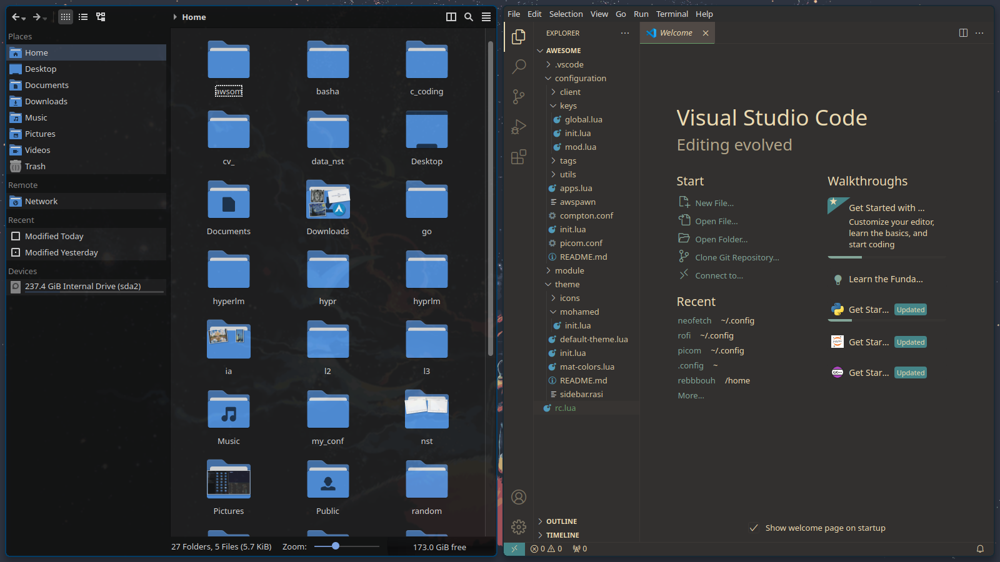
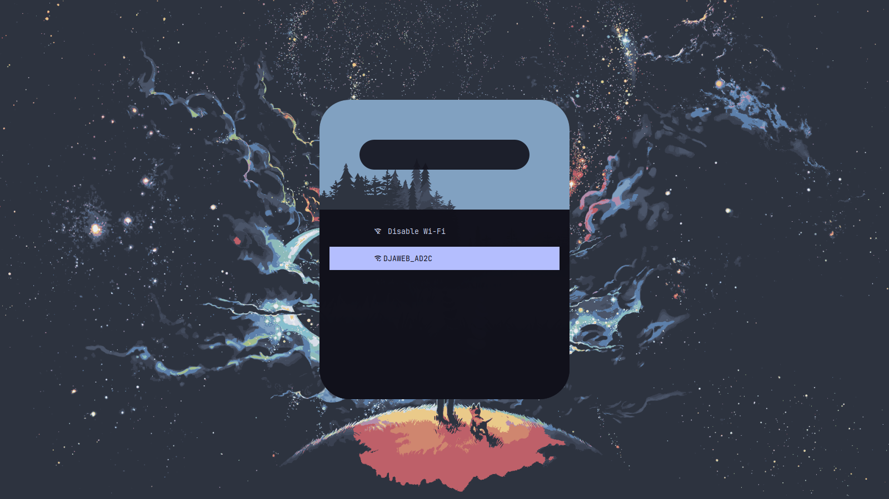

 # AwesomeWM :
 #### this is my workflow on debain base distro in this config file i delete the bare from the top for optimale use of screen space 

### program:
#### Program list

- <b>AwesomeWM</b> :as the window manager - universal package install: awesome
- <b>Rofi</b> :i use rofi for evry thing ->(wifi menu ,power menu ,show time,battry state,showing the runnig apps ..) you can even use it as file
-  <b>picom</b> :for the compositor (blur and animations) universal install: picom - Debian users need PPA  _Note: it's recommend Compton for Debian Users and the Debian Branch_
-  <b>i3lock</b>: the lockscreen application universal install: i3lock-fancy
- <b>xclip</b>: for copying screenshots to clipboard package: xclip
-  <b>gnome-polkit</b> :recommend using the gnome-polkit as it integrates nicely for elevating programs that need root access
-  <b>Materia as GTK theme</b>: - Arch Install: materia-theme debian: materia-gtk-theme
-  <b>Papirus Dark</b>: as icon theme Universal Install: wget -qO- https://git.io/papirus-icon-theme-install | sh
-  <b>lxappearance to set up the gtk and icon theme
-  <b>flameshot</b>: my personal screenshot utility of choice, can be replaced by whichever you want, just remember to edit the apps.lua file
-  <b>network-manager-appletnm-applet</b> :is a Network Manager Tray display from GNOME.
-  <b>xfce4-power-manager</b>: XFCE4's power manager is excellent and a great way of dealing with sleep, monitor timeout, and other power management features.
- <b>kitty</b>: as a terminal
- <b>dolphin </b>: as file manager 
- <b>zsh</b> : as shell

### installation :
#### 1)get dependices:
##### Debian-Based

```
sudo apt install awesome  rofi compton i3lock xclip qt5-style-plugins materia-gtk-theme lxappearance xbacklight flameshot dolphin xfce4-power-manager  network-manager-gnome policykit-1-gnome -y
wget -qO- https://git.io/papirus-icon-theme-install | sh
```

##### Arch-Based

```
yay -S awesome rofi picom i3lock-fancy xclip ttf-roboto polkit-gnome materia-theme lxappearance flameshot  network-manager-applet xfce4-power-manager qt5-styleplugins papirus-icon-theme -y
```
#### 2)get the dotfiles :
```

```
#### 3) copy the config :
navigate to the this folder 
```
cp -r ./awesome  ~/.config/
cp -r ./kityy  ~/.config/
cp -r ./rofi  ~/.config/

```
Note:make sure that the scripts in rofi folder excutabel if not run:
```
chmod +x rofi_date.sh rofi_wifi.sh rofi_power.sh

```


<div align="center">
    <table>
        <tr>
            <td></td>
            <td></td>
            <td></td>
        </tr>
        <tr>
            <td></td>
            <td></td>
            <td></td>
        </tr>
        <tr>
            <td></td>
            <td></td>
            <td></td>
        </tr>
    </table>
</div>


### key:
| Keys                                   | Action                                                          |
|----------------------------------------|-----------------------------------------------------------------|
| <kbd>Mod</kbd> + <kbd>F1</kbd>        | Show help                                                       |
| <kbd>Mod</kbd> + <kbd>w</kbd>         | View previous tag                                               |
| <kbd>Mod</kbd> + <kbd>s</kbd>         | View next tag                                                   |
| <kbd>Alt</kbd> + <kbd>Ctrl</kbd> + <kbd>Up</kbd>    | View previous tag                                    |
| <kbd>Alt</kbd> + <kbd>Ctrl</kbd> + <kbd>Down</kbd>  | View next tag                                        |
| <kbd>Mod</kbd> + <kbd>Escape</kbd>    | Go back                                                         |
| <kbd>Mod</kbd> + <kbd>d</kbd>         | Focus next client                                               |
| <kbd>Mod</kbd> + <kbd>a</kbd>         | Focus previous client                                           |
| <kbd>Mod</kbd> + <kbd>h</kbd>         | Hide focused window                                             |
| <kbd>Mod</kbd> + <kbd>=</kbd>         | Run wifi script                                                 |
| <kbd>Mod</kbd> + <kbd>r</kbd>         | Run rofi menu                                                   |
| <kbd>Ctrl</kbd> + <kbd>Space</kbd>    | Run rofi run windows                                            |
| <kbd>Mod</kbd> + <kbd>Shift</kbd> + <kbd>r</kbd> | Reboot computer                                         |
| <kbd>Mod</kbd> + <kbd>Shift</kbd> + <kbd>s</kbd> | Shutdown computer                                       |
| <kbd>Mod</kbd> + <kbd>Shift</kbd> + <kbd>l</kbd> | Run rofi log out menu                                  |
| <kbd>Mod</kbd> + <kbd>u</kbd>         | Jump to urgent client                                           |
| <kbd>Alt</kbd> + <kbd>Tab</kbd>      | Switch to next window                                           |
| <kbd>Alt</kbd> + <kbd>Shift</kbd> + <kbd>Tab</kbd> | Switch to previous window                              |
| <kbd>Mod</kbd> + <kbd>l</kbd>        | Lock the screen                                                 |
| <kbd>Mod</kbd> + <kbd>-</kbd>        | Delayed screenshot capture                                      |
| <kbd>Mod</kbd> + <kbd>p</kbd>        | Screenshot of active monitor and copy to clipboard               |
| <kbd>Alt</kbd> + <kbd>Shift</kbd> + <kbd>p</kbd> | Mark an area and screenshot it to clipboard            |
| <kbd>Mod</kbd> + <kbd>c</kbd>        | Open a text/code editor                                         |
| <kbd>Mod</kbd> + <kbd>b</kbd>        | Open a browser                                                   |
| <kbd>Mod</kbd> + <kbd>x</kbd>        | Open a terminal                                                  |
| <kbd>Mod</kbd> + <kbd>Ctrl</kbd> + <kbd>r</kbd> | Reload awesome                                             |
| <kbd>Mod</kbd> + <kbd>Ctrl</kbd> + <kbd>q</kbd> | Quit awesome                                               |
| <kbd>Alt</kbd> + <kbd>Shift</kbd> + <kbd>Right</kbd> | Increase master width factor                        |
| <kbd>Alt</kbd> + <kbd>Shift</kbd> + <kbd>Left</kbd> | Decrease master width factor                        |
| <kbd>Alt</kbd> + <kbd>Shift</kbd> + <kbd>Down</kbd> | Decrease master height factor                       |
| <kbd>Alt</kbd> + <kbd>Shift</kbd> + <kbd>Up</kbd> | Increase master height factor                         |
| <kbd>Mod</kbd> + <kbd>Shift</kbd> + <kbd>Left</kbd> | Increase number of master clients                   |
| <kbd>Mod</kbd> + <kbd>Shift</kbd> + <kbd>Right</kbd> | Decrease number of master clients                   |
| <kbd>Mod</kbd> + <kbd>Ctrl</kbd> + <kbd>Left</kbd> | Increase number of columns                          |
| <kbd>Mod</kbd> + <kbd>Ctrl</kbd> + <kbd>Right</kbd> | Decrease number of columns                          |
| <kbd>Mod</kbd> + <kbd>space</kbd>    | Select next layout                                              |
| <kbd>Mod</kbd> + <kbd>Shift</kbd> + <kbd>space</kbd> | Select previous layout                                     |
| <kbd>Mod</kbd> + <kbd>Ctrl</kbd> + <kbd>n</kbd> | Restore minimized client                                   |
| <kbd>Mod</kbd> + <kbd>z</kbd>        | Toggle dropdown application                                     |
| <kbd>Shift</kbd> + <kbd>t</kbd>      | Run rofi time script                                            |


